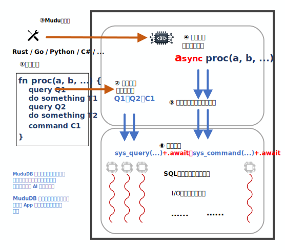

# MuduDB

[English](readme.md)

---

MuduDB 是一个数据库系统，它使构建面向数据的应用程序更加容易，并能够将其业务逻辑直接运行在数据库环境内部。

**它目前仍处于一个快速演进的早期演示阶段。**

MuduDB 正在探索一组结合数据库执行、现代工具链和 AI 辅助开发的[创新特性](doc/cn/innovative.cn.md)，以提升开发效率和系统资源利用率。

---

## 架构

上图展示了 MuduDB 的整体架构。

MuduDB 采用一种内核-运行时架构，将应用逻辑与数据管理带入统一的执行环境。

内核提供核心的正确性基础设施，包括存储、事务处理、查询执行以及执行控制。它并不暴露传统客户端驱动那样宽泛的接口面，而是定义了一组精简的[系统调用](doc/cn/syscall.cn.md)接口，用于完成会话管理与数据访问。

运行时层通过 [WebAssembly Component Model](https://component-model.bytecodealliance.org/) 承载用户定义的过程（WebAssembly）。运行时被刻意设计为被动组件：它不引入自己的调度器，也不定义独立的执行策略。过程执行由内核触发并控制，从而使调度、正确性与数据访问保持在同一个控制边界内。

在手写源码层面，Mudu Procedure 通常以顺序式风格使用通用编程语言编写（①）。与传统数据库专用存储过程语言不同，这些代码也可以通过客户端连接以交互方式直接调用（②）。MuduDB 的工具链能够将这类过程转换为可部署产物：同步源码可以被转换为异步生成形式（③），随后编译为 WebAssembly，并与相关资源（例如 schema 定义和初始数据）一起打包。

在运行时，过程调用（④）会在由内核管理的 worker 线程中贴近数据执行（⑤）。用户过程发出的系统调用会陷入内核，并在内核控制的事务与调度规则下运行（⑥）。这样可以让计算与数据访问保持共置，并减少关键路径上的跨边界交互。

执行围绕“每核一个 worker”的模型组织。每个 CPU 核心对应一个专用工作线程，而 I/O、网络处理以及用户代码执行都通过协作式方式复用在这些 worker 中。这种设计减少了线程间协调、加锁以及抢占式上下文切换，从而提升局部性并降低开销。

---

## [如何开始](doc/cn/how_to_start.cn.md)

---
